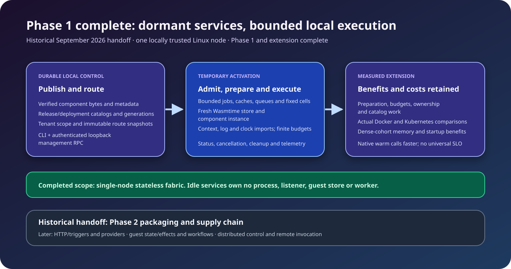
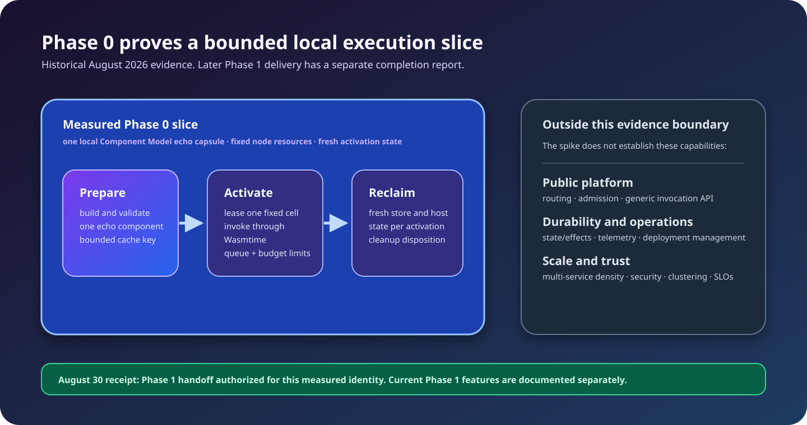

# Latent Service Fabric

Latent Service Fabric (LSF) is a component-native execution-fabric engineering
project. Its delivered Phase 1 runs independently deployable stateless service
capsules on a standalone Linux node without assigning persistent processes,
sockets, threads, guest heaps, or connection pools to idle services.

A deployed service is represented by immutable code, contracts, policy, deployment metadata, and routing metadata. Execution resources are allocated when an invocation becomes an activation. Activations execute in a fixed pool of reusable sandboxed cells; bounded catalog metadata remains resident independently of execution.

> Phase 1 and its performance extension are complete: durable catalogs and routing, admission/scheduling, generic Wasmtime execution, activation capabilities and lifecycle, telemetry, invocation/management RPCs, and an operator CLI. The [functional completion review](docs/phase-1-completion.md) and [extension report](docs/phase-1-extension-completion.md) cover scale, soak, optimization, and actual Docker/Kubernetes comparisons. These are scoped engineering results, not production SLOs. Phase 2 delivery now includes deterministic packaging, OCI distribution, publisher/provenance/SBOM verification, trusted admission and release lifecycle management, isolated AOT compilation, a protected native cache, durable audit, bounded canary observations, and manual rollout coordination. Canary-driven promotion and rollback integration remain in progress.

## Core invariant

```text
resident state = fixed node runtime + bounded catalog metadata + active activations + bounded shared caches
```

The number of operating-system processes, threads, sockets, and execution cells is node-defined and must not scale with the number of deployed services.



## Authoritative interface layers

- **WIT** defines capsule exports, platform capabilities, and component-to-component contracts.
- **Protobuf** defines control-plane, node-management, trigger-management, and generic invocation APIs.
- **JSON Schema** defines declarative capsule, deployment, binding, policy, trigger, and route documents.
- **Rust traits** define the internal architectural seams between runtime subsystems.
- **Language SDK surfaces** expose implementation-neutral client and guest contracts.

## Repository map

```text
apps/                 Standalone latentd node, operator CLI, explicit Phase 0 spike, and control-plane placeholder
crates/               Rust interfaces, delivered Phase 1 subsystems, and isolated Phase 0 regression paths
wit/                  WIT packages for platform capabilities
api/proto/            Protobuf service definitions
schemas/              JSON Schemas for declarative resources
sdk/                  Cross-language interface-only SDK surfaces
examples/             Contract and deployment examples
adr/                   Accepted architecture decisions
rfcs/                  Future design proposals
research/              Experimental tracks kept outside the production core
docs/                  Architecture, protocol, operations, and security documentation
tests/                 Cross-phase test specifications; executable tests also live with crates/apps/tools
benchmarks/            Benchmark definitions and retained Phase 0 / Phase 1 evidence
tools/                 Pinned validation, generation, spike, benchmark, and gate tooling
```

## Binaries

- `latentd`: standalone Linux node through `serve --config PATH`, plus the finite local `phase0-spike invoke-once` harness and `verify-recovery` containment proof.
- `latent-control`: clustered control-plane application placeholder.
- `latent`: bounded local manifest validation, release publication, versioned deployment, invocation/cancellation/status, routing and node inspection through generated RPC clients.

See [standalone node configuration and operation](docs/reference/standalone-node.md)
for loopback authentication, readiness, durable restart, and bounded shutdown.
The [operator CLI reference](docs/reference/operator-cli.md) and
[scriptable echo quickstart](docs/development/standalone-quickstart.md) cover the
complete local client workflow.
The explicit Phase 0 spike retains its separate measured scope.

## Delivered Phase 1 features

These implementations are usable through Rust APIs, focused tests, and the
configured standalone node's supported RPC surface.

| Feature | Implemented surface and documentation |
| --- | --- |
| Locked build and generated contracts | Protobuf/Tonic and Component Model bindings, SDK checks, deterministic test utilities; [build foundation](docs/development/build-foundation.md) |
| SDK invocation contracts | Optional caller identity, cancellation/status by known ID, and executable fixtures across six languages; [SDK contract](sdk/README.md) |
| Manifest decoding and validation | Bounded schema-backed JSON codecs, canonicalization, and stateless Phase 1 semantic validation; [manifest codec](docs/protocol/manifest-codec.md) |
| Resource accounting | Effective deadlines, concurrent budget consumption/reservations, terminal reconciliation, and cancellation primitives; [resource budgets](docs/runtime/resource-budgets.md) |
| Local release storage | Exclusive directory ownership, immutable digest verification, bounded listing/indexes, durable publication and recovery; [release catalog](docs/development/local-release-catalog.md) |
| Deployment and routing | Atomic caller version preconditions and mutation receipts, bounded tenant/service pages, immutable route generations, deterministic resolution, pinned revisions, and restart recovery; [deployment routing](docs/deployment-routing.md) |
| Admission and quotas | Tenant/trust/queue capacity, bounded input, deadline and overload checks, compatible cell selection, and affine quota permits; [admission control](docs/admission-control.md) |
| Fair scheduling | Fixed class pools, bounded tenant-fair queues, priority/deadline/aging order, shared cancellation, and owned cell/quota disposition; [scheduling](docs/scheduling.md) |
| Generic component execution | Dynamic WIT export dispatch, bounded canonical values, shared preparation, fresh stores, non-cooperative interruption, and cleanup proof; [Wasmtime backend](docs/runtime/wasmtime.md) |
| Activation capabilities | Filtered context, injectable clocks, live shared budgets, and correlated structured log acceptance; [capabilities](docs/runtime/capabilities.md) |
| Activation lifecycle | Pinned resolution, admission/scheduling, affine preparation, bounded status/journal, scoped cancellation, terminal accounting, and unconditional cleanup; [lifecycle](docs/activation-lifecycle.md) |
| Telemetry and inventory | Shared bounded export, payload-free lifecycle observation, redacted guest logs, fixed-dimension metrics, and bounded node resource snapshots; [telemetry](docs/telemetry.md) |
| Invocation service | Generated Invoke/Cancel/GetActivation adapters, scoped local authentication, manager-owned execution and retained status; [invocation service](docs/protocol/invocation-service.md) |
| Management services | Typed release uploads, atomic versioned deployments, tenant-scoped indexed reads/routes, and operator-authorized node inventory through generated RPCs; [management services](docs/reference/management-services.md) |
| Standalone node | Versioned local configuration, Linux loopback listener, fixed runtime/control workers, measured pressure/readiness, durable restart and verified shutdown; [standalone node](docs/reference/standalone-node.md) |
| Operator CLI | Private explicit profiles, bounded local preflight, one RPC per command, exact versions/identity, structured output and exit codes, and generated echo package inputs; [operator CLI](docs/reference/operator-cli.md) |
| Bounded conformance | Real CLI/node scenarios, selected adapter/RPC parity, owned child resource probes and validated diagnostic reports; [selected profile](docs/testing/phase-1-conformance.md) |
| Full measurements and comparison | Fixed-topology scale through 100,000 registrations, three mixed soaks, seven independent benchmarks and seven historical/current pairs; [full report](benchmarks/phase1/measurements/2026-09-08-container-linux-d72c99b6/REPORT.md), [controlled comparison](benchmarks/phase1/paired/2026-09-08-container-linux-e7e06f7/REPORT.md) |
| Performance extension | Verified artifact identity, shared bounded cold preparation, prepared-cache accounting, precise deadlines, request/codec ownership, configurable engine profiles, catalog memory/persistence, and indexed queue cancellation; [results and tradeoffs](docs/phase-1-extension-completion.md) |
| Docker and Kubernetes comparisons | Actual container and ClusterIP Service deployments, warm requests, first response, startup and memory measurements with replayable evidence; [Docker](docs/testing/docker-comparison.md), [Kubernetes](docs/testing/kubernetes-comparison.md) |

The [completion review](docs/phase-1-completion.md) maps the delivered behavior to
all Phase 1 acceptance criteria and records measurement limits. See
[the roadmap](docs/roadmap.md) for issue links and future phase boundaries.

The infrastructure comparisons completed 9,926 full offers per platform. Native
services had lower warm request latency; LSF used less application memory at
8 and 32 services. The reports retain cold-start boundaries, resource-limit
differences, and the Docker Desktop/WSL2 environment. They do not establish
production cluster capacity or a universal millisecond request budget.

## Phase 2 features delivered so far

| Feature | Implemented surface and documentation |
| --- | --- |
| Package and distribution | Deterministic content identities and bounded authenticated registry transfer; [packaging](docs/component-development/packaging.md), [OCI distribution](docs/reference/oci-registry.md) |
| Supply-chain verification | Publisher trust, build provenance, and package SBOM verification; [publisher trust](docs/reference/publisher-trust.md), [provenance](docs/reference/build-provenance.md), [SBOMs](docs/component-development/sbom.md) |
| Trusted admission and lifecycle | Verified catalog admission, current eligibility, durable idempotent publication/revocation/retirement/evidence renewal; [admission](docs/reference/package-admission.md), [release lifecycle](docs/reference/release-lifecycle.md) |
| Isolated compilation and native cache | Bounded compiler children and authenticated persistent native images with private keys and explicit cache ownership; [standalone configuration](docs/reference/standalone-node.md) |
| Durable administrative audit | Bounded private journal, explicit mutation acknowledgements, tenant/operator query authorization, restart coverage and retained response ownership; [audit](docs/phase-2-audit.md) |
| Canary observations | Attributable bounded outcome windows with explicit missing samples and incomplete coverage, integrated into the existing activation owner; [canary observations](docs/phase-2-canary-observation.md) |
| Manual rollout coordination | Atomic route/state publication, exact revision and cohort conflicts, bounded receipts and restart recovery, pause/resume/abort; [rollouts](docs/phase-2-rollouts.md) |

Canary observations do not independently authorize promotion. Policy-driven
promotion and rollback integration remain in progress. The [roadmap](docs/roadmap.md) tracks the
remaining Phase 2 delivery and completion gate.

## Historical Phase 0 result

The Phase 0 spike proves a deliberately narrow local feasibility slice:

1. build one Rust echo Component Model guest through generated WIT bindings;
2. load and invoke it through real Wasmtime Component Model bindings;
3. lease and reclaim one generic execution cell with a bounded queue;
4. contain declared domain errors, trap, timeout, cancellation, and memory
   pressure failures; and
5. record bounded activation-owned state and fixed runtime topology for the
   measured lifecycle.



It does **not** prove routing, admission, deployment management, production
trust/security, durable state/effects, remote invocation, cluster operation,
production SLOs, arbitrary-duration leak freedom, or the 100,000 dormant-service
invariant. The retained matched resource soak is historical, single-host
observational evidence and participates in the authorized full-gate receipt;
the authorization does not extend the Phase 0 conclusions beyond this boundary. See
[`docs/phase-0-completion.md`](docs/phase-0-completion.md) for its evidence
ledger, original authorization status, and Phase 1 handoff.

See [`docs/architecture/overview.md`](docs/architecture/overview.md) and
[`docs/testing/invariants.md`](docs/testing/invariants.md) for the proven
boundary and future invariants. Documentation SVGs follow the shared
[`SVG convention`](docs/svg-style.md).

## Build and validation

The build baseline pins Rust, Component Model, Protobuf, schema, and SDK tools. After installing the prerequisites documented in [`docs/development/toolchain.md`](docs/development/toolchain.md), validate a clean checkout with:

```bash
python3.13 -m venv .venv
. .venv/bin/activate
python -m pip install --requirement tools/requirements.lock
make validate
```

This runs the normal source, contract, SDK, and workspace checks. Expensive
ignored tests require explicit selection. The durable 100,000-release catalog
probe runs only when requested with the CI workflow's `run_catalog_scale` input
or its documented local command; native-Linux calibration and resource soaks
are also separate explicit work. See [validation tiers](VALIDATION.md).

Run the complete local Phase 0 executable demonstration with:

```bash
make phase0-spike-demo
```

The command validates contracts, builds the real guest and runtime, exercises success and containment failures only through the `latentd` executable path, includes a single-process trap-to-success recovery proof, and finishes with one successful echo result. See [`docs/phase-0-spike.md`](docs/phase-0-spike.md) for the CLI, JSON schema, exit codes, cleanup proof, and limitations.

Run the full Phase 0 completion gate with:

```bash
make phase0-gate
```

It runs the complete clean-checkout validation, executable spike, and fresh
baseline sequence, then writes a machine-readable receipt under
`target/phase0-gate/`. The retained [August 30 receipt](benchmarks/phase0/receipts/native-linux-2026-08-30-b932a935/gate-summary.json)
records the original `pass` / `authorized` result and its checked execution
identity. The [August 29 receipt](benchmarks/phase0/receipts/native-linux-2026-08-29-54d02679/gate-summary.json)
remains immutable historical evidence.
Use `make phase0-gate-smoke` for the deterministic CI-sized sequence; it
records the same receipt format without presenting smoke coverage as
authorization.

Generated bindings, parsed WIT output, Protobuf descriptors, and SDK compiler artifacts are isolated under Cargo `OUT_DIR` or `target/contracts/`; handwritten contract sources are never overwritten. See [`VALIDATION.md`](VALIDATION.md) for the checks performed.

## License

Apache License 2.0. See [`LICENSE`](LICENSE).
