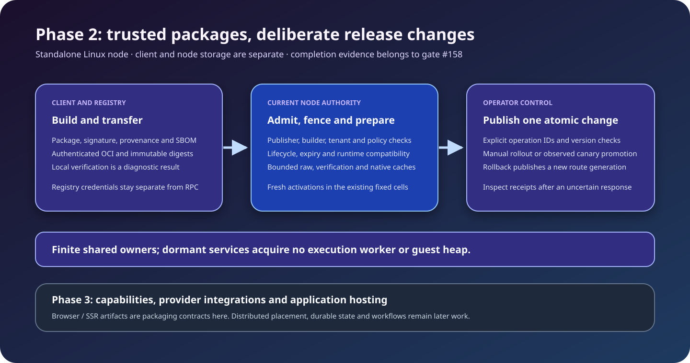
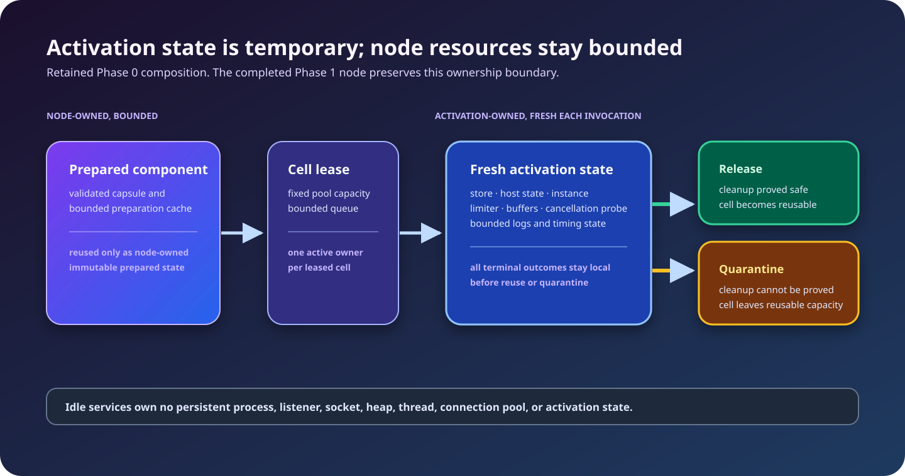

# LSF architecture overview

## Definition

Latent Service Fabric is a component-native execution fabric in which deployed services are dormant immutable artifacts. Requests become temporary activations. Activations execute inside a fixed pool of reusable sandboxed cells and release activation-owned execution resources when they finish. Durable suspension remains a later-phase model.

Phase 1 and its prioritized performance extension are complete. The completed
[Phase 2](../phase-2-completion.md) adds packaging and authenticated OCI transfer,
enforced catalog admission, release lifecycle, compatibility, raw/native caches, durable audit and
atomic rollout, promotion and rollback. The current product remains a standalone
Linux stateless node, with explicit trusted-local or enforced release policy.
[Phase 3](../roadmap.md#phase-3-capabilities-and-application-hosting)
has a concrete capability/provider and web-hosting backlog; those providers and
application ingress are not implemented by their WIT or package declarations.



The [historical Phase 1 diagram](../assets/phase1-delivery-boundary.svg) and its
retained measurements still describe that milestone. Phase 2 extends that
delivery boundary without retroactively changing its evidence.

## Resource invariant

```text
resident state = fixed node runtime + bounded catalog metadata + active activations + bounded global caches
```

A deployed but inactive service owns no process, operating-system thread, listener, guest heap, runtime instance, database connection pool, HTTP client pool, timer loop, or telemetry exporter.

Artifact storage, contract indexes, route indexes, policy metadata, and bounded cache entries are permitted to grow with registered service count. Execution allocation is not.

The standalone node also owns one fixed async cleanup supervisor with slots
bounded by its admitted activation capacity. After a transport disconnect, it
continues polling the same activation owner under its original deadline, keeping
quota and cell ownership through bounded cleanup. It adds no per-service worker
or per-disconnect task. Cell reuse still requires affirmative cleanup proof;
uncertain cleanup remains quarantined.

Phase 2's optional audit worker and rollout coordinator are fixed node owners.
Configured native compilation may launch a bounded one-job child; it retains
input, output and process reservations through actual reap. A deployment does
not keep a compiler process or timer alive. Raw files, mapped code, retained
responses and audit history have independent finite limits; those allowances
are not claims of constant RSS or eagerly allocated capacity.

## Phase 0 evidence boundary

Phase 0 implements one deliberately narrow local composition. Its evidence
shows that the project can build a real Rust echo Component Model guest with
generated WIT bindings; load and invoke it through real Wasmtime Component
Model host bindings; lease a fixed generic cell; create fresh
activation-owned stores and host state; contain the tested failure paths; and
affirmatively reclaim measured activation resources.

The configured runtime workers, process count, listeners/sockets, and cell
capacity remain fixed through the measured lifecycle. Wasmtime may create one
bounded epoch-interruption helper thread after preparation; that is fixed
node/runtime infrastructure, not a per-service thread.

The retained August 30 native-Linux resource soak has a matched calibration
identity and complete descriptor-lifecycle evidence. The full gate
independently regenerated it with the matching profile and calibration,
validated a fresh baseline, and authorized Phase 1 for the common canonical
execution identity. The measurements remain observational and single-host;
authorization does not imply production readiness or Phase 1 API
compatibility. Their boundaries and the handoff are recorded in
[`../phase-0-completion.md`](../phase-0-completion.md).



Phase 0 did not prove dormant registration at 100,000 services, route or
admission behavior, persistent management/deployment, production
trust/security, generic dispatch, durable state/effects, remote transport,
cluster behavior, or production telemetry/SLOs.

## Service model

The current [standalone Linux node](../reference/standalone-node.md) composes
durable release and deployment catalogs, immutable routing, admission, fair
scheduling, [generic Wasmtime execution](../runtime/wasmtime.md), activation
capabilities and lifecycle management, telemetry, and invocation and management
RPCs. The [operator CLI](../reference/operator-cli.md) drives both the retained
local release-to-invocation workflow and [Phase 2 operations](../phase-2-operator-workflows.md):
package build/inspection/verification, OCI transfers, release evidence/lifecycle,
managed deployment receipts, staged rollout, canary, rollback and audit queries.
Node credentials and registry credentials remain separate. A local path never
becomes a node catalog path, and diagnostic package verification cannot create
execution authority. The
[Phase 1 completion review](../phase-1-completion.md) records the delivered
stateless surface, acceptance evidence and completion decision.
[Bounded conformance](../testing/phase-1-conformance.md) covers selected scenarios.
The [full measurements](../../benchmarks/phase1/measurements/2026-09-08-container-linux-d72c99b6/REPORT.md)
show fixed node topology through 100,000 releases/deployments and bounded
reclamation across three mixed soaks; catalog metadata RSS grows and is reported
separately. The [controlled comparison](../../benchmarks/phase1/paired/2026-09-08-container-linux-e7e06f7/REPORT.md)
records actual productionization overhead and its measurement boundaries.

The [completed extension](../phase-1-extension-completion.md) records warm/cold
preparation, budget, cache, ownership, codec, catalog and scheduler changes, plus
actual Docker and Kubernetes comparisons. Native handlers retain lower warm
latency in those infrastructure campaigns; LSF reduces memory and startup cost
for their dense cohorts. Results include mixed regressions and do not establish
a universal millisecond SLO or production cluster capacity.

```text
Service = stable logical name
Release = immutable component digest
Package = exact package-manifest digest, when packaged
Revision = release + deployment configuration
Route = rule selecting a revision
Activation = revision × function × input × identity × budget × deadline
Current stateless result = output or typed failure + accounting
Later transactional result = output + state commit + effect intents + accounting
```

There is intentionally no `Service = PID + port + heap + threads` relationship.

## Planes

### Developer plane

Builds WIT contracts and language components, packages supplied component bytes,
produces explicit SBOM/provenance evidence, signs exact package identities and
transfers immutable content through OCI. The package CLI does not execute build
scripts or manufacture signatures/provenance.

### Control plane

Stores local desired state, validates releases and current authority, compiles
routes, records bounded inventory/audit and atomically publishes immutable route
snapshots with rollout progress and operation receipts. General capability
binding compilation is Phase 3; remote distribution is Phase 5.

### Data plane

Receives authenticated direct calls, resolves exact local revisions, performs
admission and bounded preparation, schedules fresh activations, checks current
release authority, binds supported capabilities and executes guest code. It
returns stateless results and accounting after contained cleanup.

The [control-plane](control-plane.md), [data-plane](data-plane.md) and
[security](security.md) pages explain the delivered seams. General HTTP/event
ingress and providers are Phase 3. Guest transactions/effects, clustered control
and durable workflows remain Phases 4, 5 and 6 respectively. Phase 0 implemented
only the original local preparation, execution, containment and reclamation slice.

## Physical topology

```text
Developer tooling ──► OCI registry
                         │
Management client ──► latent-control ──► PostgreSQL
                         │ route snapshots
                         ▼
Ingress ─────────────► latentd nodes ◄────► latentd nodes
                         │
                         ├── state backend
                         ├── effect providers
                         └── telemetry collector
```

The diagram shows the intended Phase 5 clustered topology, not current
deployment. Standalone mode embeds local desired-state catalogs and supported
management services in one Linux `latentd` process using durable local storage.
Operators can transfer a package through OCI and submit its exact bytes/evidence
to the node's independent admission boundary. The node does not infer permission
from a tag, registry credential or client-side verification result. PostgreSQL,
inter-node invocation and state/effect backends remain later work.

## Fixed process model

A production node may have a fixed set of execution-host processes partitioned by trust class or workload class:

```text
latentd supervisor
├── trusted execution host
├── ordinary tenant execution host A
├── ordinary tenant execution host B
├── restricted/high-value execution host
└── optional native compatibility host
```

This is a possible future execution topology. Current guest execution uses fixed
in-process cells; stronger trust-class process isolation remains later work.
The optional Phase 2 compiler child is temporary bounded compilation work, not
one of these guest execution hosts or a dormant service process.

## Technology direction

- WebAssembly Component Model for portable polyglot capsule boundaries.
- WIT for capsule exports, imports, and host capabilities.
- Wasmtime as the initial execution engine behind `ExecutionBackend`.
- OCI artifacts for content-addressed distribution.
- Protobuf for control-plane and generic management RPCs.
- A transport abstraction suitable for WIT-native remote invocation.
- Explicit state transactions and durable effect intents.

These are recorded in ADRs and remain replaceable behind the Rust trait boundaries where explicitly stated. Phase 1 applies the retain/harden/generalize/rewrite/delete handoff in [`../phase-0-completion.md`](../phase-0-completion.md); the [completion review](../phase-1-completion.md) identifies the retained isolated regression paths and current product surface.
