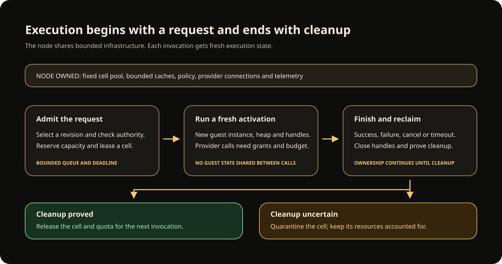

# LSF architecture overview

LSF runs stateless service capsules on a standalone Linux node. A deployed
capsule is stored code, contracts and configuration. A request creates a
short-lived activation inside a fixed pool of sandboxed execution cells.
The node reclaims that activation's execution resources when it finishes.

The current development implementation includes authenticated invocation and
management, package admission, rollout and recovery, capability providers,
shared HTTP ingress, static-site delivery and the supported Angular SSR profile.
See [Run your first node](../start/first-node.md) for a working local example.

## From source to service

[](../assets/package-delivery.svg)

[Open the delivery diagram at full size](../assets/package-delivery.svg).

Developer tooling builds a component or website and packages selected output.
Publisher signatures and build evidence accompany the immutable package.
An OCI registry can transfer those bytes. The node checks its own current trust
policy before admitting them; a registry account or local verification result
does not grant execution permission.

A deployment selects an admitted publication and its configuration. Calls select
a revision through the node's routing table. The node authenticates the caller,
checks admission and execution authority, and runs the selected component.
[Managed operations](../phase-2-operator-workflows.md) retain operation identities
for inspecting uncertain outcomes. [Rollout](../phase-2-rollouts.md) and
[rollback](../phase-2-rollback.md) publish new routes explicitly.

## Resource ownership

```text
resident state = fixed node runtime + bounded catalog metadata + active activations + bounded shared caches
```

An inactive deployment owns no executing guest, dedicated process, operating
system thread, listener, guest heap, connection pool, timer loop or telemetry
exporter. Catalog, route and policy metadata can grow with deployment count
within configured bounds. Execution allocation follows active work.

[](../assets/activation-lifecycle.svg)

[Open the activation diagram at full size](../assets/activation-lifecycle.svg).

Each invocation gets fresh guest state, a deadline and a budget. Capability
handles belong to that activation. Success, declared errors, traps,
cancellation and timeout all lead through cleanup. Cell reuse requires proof
that cleanup completed; uncertain cleanup keeps the cell quarantined and its
resources accounted for.

A fixed node cleanup supervisor keeps ownership after a client disconnects.
It does not create a worker for each disconnected caller. Node-wide audit,
rollout, provider and telemetry owners have finite capacity. Optional native
compilation runs a bounded temporary child process; a dormant service keeps no
compiler alive. Limits on stored bytes or reservations are separate from
measured process memory.

## Names you will encounter

| Name | Meaning |
| --- | --- |
| Service | A stable logical name that callers use. |
| Capsule | A Wasm component together with its callable WIT contracts. |
| Package | The exact manifest, configuration and payload bytes delivered together. |
| Publication | An admitted package identity with its current trust and lifecycle state. |
| Deployment | A selected publication and its execution, routing and capability configuration. |
| Revision | The exact deployment selection used by an invocation. |
| Activation | One invocation's input, identity, budget, deadline and temporary execution state. |

The [runtime identity guide](../learn/runtime-identities.md) explains how to keep
these identities distinct when deploying and recovering an application.

## Node responsibilities

**Build and delivery tooling** compiles sources, records build inputs, packages
output and transfers content. Package assembly itself does not run arbitrary
build scripts or invent signatures and provenance.

**Management services** maintain the local catalogs, validate current authority,
compile grants and bindings, and atomically publish route snapshots. Deployment,
rollout and audit receipts support explicit recovery after an uncertain reply.

**Execution services** authenticate calls, select revisions, enforce admission
and scheduling, prepare components and create fresh activations. Calls into
providers check current grants, bindings, provider identity and remaining budget.
See [capability bindings](../runtime/capability-bindings.md) and
[activation lifecycle](../activation-lifecycle.md).

## Providers and browser delivery

The runtime has HTTP, streaming HTTP, immutable blob, secret, event, local-call,
randomness and custom-metric integrations. The
[standalone provider configuration](../reference/standalone-providers.md)
installs buffered HTTP, local immutable blobs, activation clocks and OS-backed
randomness through explicit configuration, bindings and grants. Streaming HTTP,
S3, Vault, NATS and the other embedding integrations use their documented
trusted Rust composition; their presence in the source does not add fields to
the standalone JSON configuration.

The shared [HTTP ingress](../reference/http-ingress.md) handles configured
application routes with bounded request and response ownership. A
[static site](../component-development/static-sites.md) serves admitted public
files without executing a guest. The supported
[Angular renderer](../component-development/angular-build.md) runs inside a
component activation and supplies server-rendered HTML alongside browser assets.
This profile does not run a general Node.js server or arbitrary npm middleware.

## Current topology and limits

A standalone deployment uses one Linux `latentd` process, durable local storage,
fixed runtime and control workers, and configured shared listeners. External
clients use authenticated RPCs; browsers use the configured HTTP ingress.
Optional external provider services and an OCI registry have their own owners.
The node does not run a process or open a port for each deployed capsule.

Durable guest state, transactional effects, cluster placement and durable
workflows are not implemented. A completed HTTP call or event publication is
not a universal exactly-once transaction. Stronger isolation through separate
guest execution processes is also not part of the current cell model.

For configuration, use the [node reference](../reference/standalone-node.md).
For a design rationale, use the [architecture decisions](../../adr/README.md).
Contributors can find historical measurements and their tested scope in the
[validation guide](../../VALIDATION.md).
