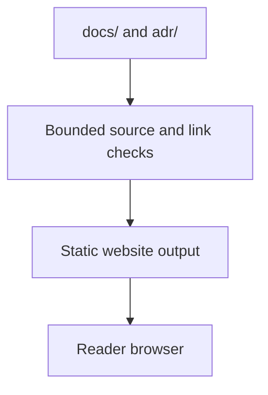

# Website foundation: local development and validation

## Outcome and supported boundary

Build the current repository documentation as a static Docusaurus site without
building Rust, executing SDKs, starting an LSF node or obtaining deployment
credentials. This implements the foundation selected in
[ADR-0041](../../adr/0041-publish-single-source-version-bound-documentation.md).
It is not the complete [migration gate #345](https://github.com/KirilsTurkins/latent-service-fabric/issues/345),
a released documentation snapshot, a Node hosting product, or runtime qualification.



The main docs plugin reads `../docs` directly from `website/`; decisions use a
separate `../adr` plugin. There is no edited `website/docs` copy. Existing current
documents remain in place. `docs/wiki` is excluded and separately counted;
the initial checkout has no tracked files there. The historical Wiki branch and
frozen publication receipt are not merged or rewritten. #356 owns the useful
content migration and removal of the public Wiki after Phase 3 completion and
verified site deployment, including retirement of the second writer. Old Wiki
URLs and archive notices are not required.

## Toolchain and installation

Use Node **24.19.0** and npm **11.19.1**. These website pins do not change the SDK or
Angular qualification profiles. [The private package](../../website/package.json),
[lock](../../website/package-lock.json) and
[reviewed identities](../../website/content/toolchain.json) are isolated from
root Cargo and SDK manifests. Docusaurus 3.10.2, React 19.3.0 and TypeScript 5.9.3
are exact pins, not floating recommendations. There is no root npm workspace.

From the repository checkout:

```text
cd website
node --version
npm --version
npm ci --ignore-scripts --no-audit --no-fund
npm run check
npm test
npm run build
npm run build:root
```

The checked-in `.npmrc` also disables dependency lifecycle scripts, requires the
engine versions, and bounds npm fetches to one retry and 60 seconds per request.
Use `npm ci`, not a fresh unlocked install, for verification. Framework build
code still executes when explicitly invoked: lifecycle-script suppression is
not a dependency sandbox. The checked-in package intentionally does not declare
`type: module`; the pinned Docusaurus generated webpack registry expects that
package boundary. Local plugins/scripts remain explicit `.mjs`, and application
configuration/pages use TypeScript.

The first production output is `website/build/project/`, configured for
`https://kirilsturkins.github.io/latent-service-fabric/`. The second is
`website/build/root/`, configured for the reserved example origin
`https://docs.example.invalid/`. Both are **local configurations**, not claims
that either deployment or custom domain exists. The wrapper accepts only these
fixed output locations, uses two SSR tasks/worker threads, a 4 GiB Node heap
ceiling and a ten-minute production-build deadline. It terminates the owned
process tree on timeout. The server is static output, not an LSF execution host.

For a live authoring preview:

```text
npm run start
```

It listens only on `127.0.0.1:3000`; stop it with Ctrl+C. The source/route/asset
inventory is a startup snapshot: restart the preview after adding files,
changing routes/anchors, changing asset registration or dependencies. A fresh
production build, not hot reload, is the acceptance check.

## Actual built-site tests

Install the exact browser associated with the locked Playwright package, then
test both completed production outputs:

```text
npm run browser:install
npm run test:build
```

The browser install and built-site test have separate three-minute deadlines.
Browser files stay in `website/.generated/browsers`; they are not fetched by a
normal site build. The test starts temporary loopback-only static servers,
checks all source-backed pages' local links and rendered anchors, verifies
commit-pinned edit links and copied asset hashes, then exercises actual Chromium
navigation, nested-page reloads, SVG/Mermaid loading and a narrow viewport at both base
paths. Unexpected external browser requests and JavaScript errors fail. Unknown
pages return 404 rather than silently falling back to the homepage. This is
foundation browser evidence, not #354's complete accessibility/search campaign.
Stale source identities/document bytes, incorrect commit-bound source links and
private build paths in public JavaScript also fail. Docusaurus serializes its
configuration: the private input index is held in server-only closures, not
serializable plugin options. A public input fingerprint invalidates compiler
caches when revisions, document bytes/routes, approved assets or base paths change.

`website/.generated/build-evidence.json` retains compact counts, source SHA,
dirty flag and base paths. Each output has `site-manifest.json` with page and
approved-asset hashes. Hashes describe checked-out bytes, not rewritten or
normalized historical content. A dirty local build is labelled and is not exact
commit publication evidence; final publishing must require a clean bound source
and #353's snapshot identities.
Small `project-home.png`, `project-mobile.png`, `root-home.png` and
`root-mobile.png` screenshots remain under `.generated/` for visual inspection.

Generated dependencies/output remain under ignored `website/node_modules`,
`.docusaurus`, `.generated` and `build`. Stop the preview before cleaning only
those website-local generated directories. Do not clean repository source,
another worktree, root `target`, SDK build trees or benchmark evidence as part of
website maintenance.

## Markdown, links and approved assets

The actual pinned compiler's `format: detect` distinguishes CommonMark/GFM `.md`
from interactive `.mdx`. Upstream describes CommonMark detection as experimental;
the fixture suite tests its actual behavior instead of assuming GitHub rendering
equivalence. Tables, fenced code, details/HTML, Unicode, headings and Mermaid
syntax have compiler fixtures; the production build covers the entire current
non-Wiki docs and ADR corpus. Source bytes are not bulk-converted to MDX.

Supported front matter uses safe YAML parsing. IDs/slugs are collision-checked;
front matter cannot change a file's execution mode. Draft/hidden/custom-edit
overrides require an explicit publication-contract extension instead of silently
evading the page inventory. Literal HTML/MDX URLs pass the same resolver as
Markdown links. MDX imports are restricted to reviewed site components and theme
components, with direct traversal/linked-file checks. MDX, site code, plugins
and dependencies are nevertheless **reviewed executable build inputs**, not
hostile-author sandboxes. The plugin never fetches remote includes or executes
owning SDK examples to fill a page.

Relative links resolve from the original source path. Published docs and ADRs
map to site routes; other tracked files/directories map to the exact source
commit on GitHub. Current repository Markdown anchors and source line anchors
are checked locally. Explicit historical commit URLs remain historical; external
URL availability is not asserted by the local checker. Case mismatches, missing
targets, ambiguous routes, unsafe URL schemes, encoded path separators and
repository escapes fail.

[Asset registration](../../website/content/assets.json) permits only explicit
bounded SVG illustrations/global brand files and bounded text/JSON downloads in
approved documentation-asset paths. No repository root, SDK tree, private
fixture, signing material or benchmark archive is copied. The initial five SVGs
are copied byte-for-byte. Their checked URLs become literal image attributes
rather than webpack resolving a project-prefixed URL as a filesystem path;
broken-link/image errors stay enabled and real built-image loading is tested.
Approved file hyperlinks use Docusaurus's static `pathname://` marker only after
local resolution and approval, avoiding router-added trailing slashes. Authored
markers cannot bypass preflight; the built-output checker still verifies every
static target and copied byte. Mixed image/download references have a fixture.
Global brand assets live under `website/static/brand` and use a channel-independent
route; version-associated illustrations use the content channel and byte hash.
The brand directory is not implicitly copied. Theme/palette work remains #349/#350.

## Coverage is a review contract, not a page counter

[The finite coverage inventory](../../website/content/coverage.json) has 27
required outcome rows across #345's six areas. Its
[contract](../../website/content/coverage-contract.json) and
[schema](../../website/content/coverage.schema.json) validate unique IDs, actual
published pages, source/evidence paths, implementation prerequisites and delegated
guide owners. All initial practical-guide reviews remain explicitly pending.
Linked test sources are labelled available-not-run, not executed receipts.
Guide/runbook owners and phase gates cannot be implementation prerequisites:
#237 consumes the guides, not the other way around.

```text
npm run coverage:acceptance
```

This command is expected to **fail while guide review remains pending**. The
ordinary `check` verifies truthful metadata without claiming guide completion.
Acceptance additionally requires an actual guide, all ten authoring criteria,
human review of an exact commit and version-bound execution receipts. A page
being present or a test file existing cannot satisfy those conditions. #237
retains the integrated runbook/support matrix, with #357/#358/#359/#361 as its
delegated authoring owners. No runtime examples are executed by this checker.
Use the [27-outcome review checklist](phase3-guide-review.md) to collect rendered
walkthrough results and record the exact source reviewed.

## Narrow handoffs to the remaining children

| Owner | Foundation interface and retained responsibility |
| --- | --- |
| #351/#352 | Consume registered `examples/guides/` scenarios with exact source/version/region and finite bytes/lines; return display text/hash/verification level. Add reviewed site components for switching, never duplicated SDK implementations. No extractor or switching UI is claimed here. |
| #353 | Extend the `site-manifest` schema/version binding atomically with `versioned_docs`, `versioned_sidebars`, `versioned_examples` and versioned illustrations. Missing historical examples must fail, not use current SDK files. Bootstrap the actual existing alpha release. |
| #349/#350 | Add reviewed shared theme tokens/global brand assets and separately approved maintained illustrations; preserve frozen historical bytes. |
| #354 | Consume page source/route/hash/channel metadata for version-aware search and complete keyboard/accessibility/browser checks. |
| #355 | Keep one protected development-branch Pages writer, add scoped website CI and exact generated-directory exclusions, then verify real deployment/rollback. Preserve existing `CI result` and documentation/frozen-evidence profiles. |
| #356 | Migrate useful unique Wiki content, verify the deployed site and switch entry points; remove the Wiki after Phase 3 completion and retire its publisher. Old Wiki URLs and obsolete content have no compatibility requirement. |

The current repository CI conservatively selects full validation for unknown
website source. This foundation does not change `ci.yml`, broadly exempt the
website from source validation, or claim the future website-only workflow exists.
#355 must specifically exclude generated `website/.docusaurus` and `website/build`
when integrating filesystem-based validators; `.generated`/`node_modules` already
have existing generated-directory handling. The new manifest/lock also needs
coordinated registration with #282's SDK/ecosystem inventory, not an empty scan.

## Dependency update and failure ownership

@KirilsTurkins owns framework/plugin upgrades and review. Verify official
registry/upstream identities, update exact pins and the isolated lock in a PR,
then run the complete commands above plus fresh npm/OSV checks of every locked
dependency. No automatic dependency
merge or workflow approval is added. Three narrow reviewed overrides remove
actual lodash-es, serialize-javascript and SockJS/uuid advisory matches; the
toolchain record names their exact upstream commits and compatibility rationale.
They are patched dependencies, not advisory suppressions. The install/runtime
API fixtures and real production build must continue to pass when retiring them.

Missing files/anchors or asset approval fail preflight with their original source
path. Compiler errors remain visible and must be fixed in owned code or reported
as migration incompatibilities; do not rewrite frozen content to hide them.
Browser installation failure is distinct from a passing compiler test. No live
Pages deployment, released snapshot, full guide acceptance, or Linux-host result
is inferred from local Windows success. The continuing documentation milestone
stays open after the finite initial gate is eventually accepted.
