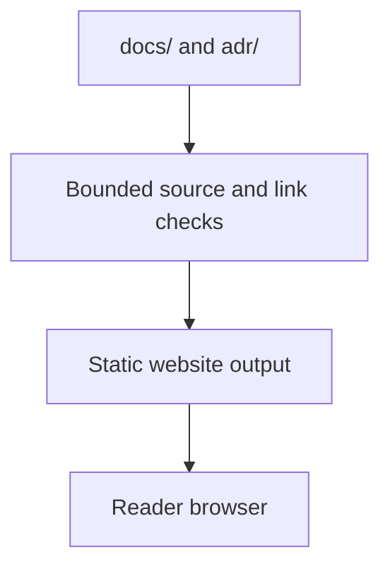

# Website development and validation

## Outcome and supported boundary

Build the current repository documentation as a static Docusaurus site without
building Rust, executing SDKs, starting an LSF node or obtaining deployment
credentials. This implements the publication model selected in
[ADR-0041](../../adr/0041-publish-single-source-version-bound-documentation.md).
Website checks cover the rendered documentation; SDK execution and native
runtime qualification retain their separate source-bound results.


```mermaid
flowchart TD
  Source["docs/ and adr/"] --> Validation["Bounded source and link checks"]
  Validation --> Output["Static website output"]
  Output --> Reader["Reader browser"]
```

The main docs plugin reads `../docs` directly from `website/`; decisions use a
separate `../adr` plugin. There is no edited `website/docs` copy. Current guides
may be consolidated as the product changes; frozen releases retain their
recorded bytes. The public Wiki and its publishers are already disabled. The
[migration record](wiki-migration.md) identifies the maintained replacement
pages and the successful complete-site cutover checks. Historical evidence remains
unchanged; obsolete Wiki URLs have no compatibility requirement.

## Toolchain and installation

Use Node **24.19.0** and the locally patched npm **11.19.1**. These website pins do not change the SDK or
Angular qualification profiles. [The private package](../../website/package.json),
[lock](../../website/package-lock.json) and
[reviewed identities](../../website/content/toolchain.json) are isolated from
root Cargo and SDK manifests. Docusaurus 3.10.2, React 19.3.0 and TypeScript 5.9.3
are exact pins, not floating recommendations. There is no root npm workspace.

From the repository checkout, use the system npm only to bootstrap the separately
locked toolchain. Replace its vulnerable bundled dependencies before invoking it:

```text
node --version
npm ci --prefix website/toolchain --ignore-scripts --no-audit --no-fund
node website/scripts/patch-package-manager.mjs
node website/toolchain/node_modules/npm/bin/npm-cli.js ci --prefix website --ignore-scripts --no-audit --no-fund
cd website
node toolchain/node_modules/npm/bin/npm-cli.js run check
node toolchain/node_modules/npm/bin/npm-cli.js test
node toolchain/node_modules/npm/bin/npm-cli.js run build
node toolchain/node_modules/npm/bin/npm-cli.js run build:root
```

Run the patch command after every clean toolchain install. npm bundles its own
copy of `ip-address`; an override or a lockfile-only edit does not replace those
files. The bootstrap installs the separately integrity-pinned upstream 10.7.2,
replaces the complete bundled copy, and verifies the installed graph and NAT64
classification before the selected npm runs. The same step replaces bundled
Undici with 6.28.1 and `brace-expansion` with 5.0.12, and checks their real module
resolution and security controls. See the
[security bootstrap details](../../website/README.md#package-manager-security-bootstrap).
For every later `npm run` command in this guide, use
`node toolchain/node_modules/npm/bin/npm-cli.js run` from `website/`, or explicitly
place `website/toolchain/node_modules/.bin` first on your shell's `PATH`.
A global npm 11.19.1 installation does not include this local security fix.

The checked-in `.npmrc` also disables dependency lifecycle scripts, requires the
engine versions, and bounds npm fetches to one retry and 60 seconds per request.
Use `npm ci`, not a fresh unlocked install, for verification. Framework build
code still executes when explicitly invoked: lifecycle-script suppression is
not a dependency sandbox. The checked-in package intentionally does not declare
`type: module`; the pinned Docusaurus generated webpack registry expects that
package boundary. Local plugins/scripts remain explicit `.mjs`, and application
configuration/pages use TypeScript.

The first production output is `website/build/project/`, configured for
`https://kirilsturkins.github.io/latent-service-fabric/`. The second is
`website/build/root/`, configured for the reserved example origin
`https://docs.example.invalid/`. Both are **local configurations**, not claims
that either deployment or custom domain exists. The wrapper accepts only these
fixed output locations, uses two SSR tasks/worker threads, a 4 GiB Node heap
ceiling and a ten-minute production-build deadline. It terminates the owned
process tree on timeout. The server is static output, not an LSF execution host.

For a live authoring preview:

```text
npm run start
```

It listens only on `127.0.0.1:3000`; stop it with Ctrl+C. The source/route/asset
inventory is a startup snapshot: restart the preview after adding files,
changing routes/anchors, changing asset registration or dependencies. A fresh
production build, not hot reload, is the acceptance check.

## Actual built-site tests

Install the exact browser associated with the locked Playwright package, then
test both completed production outputs:

```text
npm run browser:install
npm run test:build
npm run test:theme
npm run test:examples
npm run test:versions
npm run test:discovery
```

The browser install and basic built-site test have separate three-minute
deadlines. Theme, example and discovery checks each have five minutes; version
checks have ten minutes. A timeout fails its check.
Browser files stay in `website/.generated/browsers`; they are not fetched by a
normal site build. The test starts temporary loopback-only static servers,
checks all source-backed pages' local links and rendered anchors, verifies
commit-pinned edit links and copied asset hashes, then exercises actual Chromium
navigation, nested-page reloads, SVG/Mermaid loading and a narrow viewport at both base
paths. Unexpected external browser requests and JavaScript errors fail. Unknown
pages return 404 rather than silently falling back to the homepage. This is
built-site evidence. The additional suites cover theme layouts, language tabs
and copying, frozen versions, version-aware search, setup-script downloads,
keyboard navigation and desktop/mobile accessibility.
Stale source identities/document bytes, incorrect commit-bound source links and
private build paths in public JavaScript also fail. Docusaurus serializes its
configuration: the private input index is held in server-only closures, not
serializable plugin options. A public input fingerprint invalidates compiler
caches when revisions, document bytes/routes, approved assets or base paths change.

`website/.generated/build-evidence.json` retains compact counts, source SHA,
dirty flag and base paths. Each output has `site-manifest.json` with page and
approved-asset hashes. Hashes describe checked-out bytes, not rewritten or
normalized historical content. A dirty local build is labelled and is not exact
commit publication evidence; final publishing must require a clean bound source
and the recorded snapshot identities.
Small `project-home.png`, `project-mobile.png`, `root-home.png` and
`root-mobile.png` screenshots remain under `.generated/` for visual inspection.

Generated dependencies/output remain under ignored `website/node_modules`,
`.docusaurus`, `.generated` and `build`. Stop the preview before cleaning only
those website-local generated directories. Do not clean repository source,
another worktree, root `target`, SDK build trees or benchmark evidence as part of
website maintenance.

## Markdown, links and approved assets

Current navigation groups pages by the reader's task. Start contains setup;
Learn contains capsule, client and web walkthroughs; How-to contains development
and operator tasks; Reference contains command, language profile and protocol
details. Each uses collapsible subsections defined in
[`navigation.mjs`](../../website/lib/navigation.mjs). OS differences belong inside
the relevant guide. Language implementations share selectable examples in the
capsule guide; compiler integration recipes belong in the language profile
subsection. Contribute remains for work on LSF itself.

The same navigation builder creates current and newly frozen sidebars. Tests
check that every published document belongs exactly once, the first application
path stays ordered, and the six compiler profiles do not duplicate the learning
path. Existing frozen release sidebars remain unchanged.

Registered example markers in Markdown render the reviewed `CodeExample`
component with its shared language selector. Ordinary Markdown prose stays
inert. Use registered scenarios from `examples/guides/`; extraction checks the
selected source, language and region with finite byte/line bounds. Keep the
implementation in its owning SDK or example. Historical pages use their frozen
example bundle and cannot fall back to the current SDK source.

For a long setup script, place `<!-- lsf-download: setup-name.ps1 -->` immediately
before its PowerShell fence, or use `.sh` with Bash and `.py` with Python. The
site offers a download and a collapsed source view, both from that same fence.
It does not execute the script. Keep the short invocation and expected outcome
visible in the guide.

The actual pinned compiler's `format: detect` distinguishes CommonMark/GFM `.md`
from interactive `.mdx`. Upstream describes CommonMark detection as experimental;
the fixture suite tests its actual behavior instead of assuming GitHub rendering
equivalence. Tables, fenced code, details/HTML, Unicode, headings and Mermaid
syntax have compiler fixtures; the production build covers the entire current
non-Wiki docs and ADR corpus. Source bytes are not bulk-converted to MDX.

Supported front matter uses safe YAML parsing. IDs/slugs are collision-checked;
front matter cannot change a file's execution mode. Draft/hidden/custom-edit
overrides require an explicit publication-contract extension instead of silently
evading the page inventory. Literal HTML/MDX URLs pass the same resolver as
Markdown links. MDX imports are restricted to reviewed site components and theme
components, with direct traversal/linked-file checks. MDX, site code, plugins
and dependencies are nevertheless **reviewed executable build inputs**, not
hostile-author sandboxes. The plugin never fetches remote includes or executes
owning SDK examples to fill a page.

Relative links resolve from the original source path. Published docs and ADRs
map to site routes; other tracked files/directories map to the exact source
commit on GitHub. Current repository Markdown anchors and source line anchors
are checked locally. Explicit historical commit URLs remain historical; external
URL availability is not asserted by the local checker. Case mismatches, missing
targets, ambiguous routes, unsafe URL schemes, encoded path separators and
repository escapes fail.

[Asset registration](../../website/content/assets.json) permits only explicit
bounded SVG illustrations/global brand files and bounded text/JSON downloads in
approved documentation-asset paths. No repository root, SDK tree, private
fixture, signing material or benchmark archive is copied. Registered SVGs are
copied byte-for-byte. Their checked URLs become literal image attributes
rather than webpack resolving a project-prefixed URL as a filesystem path;
broken-link/image errors stay enabled and real built-image loading is tested.
Approved file hyperlinks use Docusaurus's static `pathname://` marker only after
local resolution and approval, avoiding router-added trailing slashes. Authored
markers cannot bypass preflight; the built-output checker still verifies every
static target and copied byte. Mixed image/download references have a fixture.
Global brand assets live under `website/static/brand` and use a channel-independent
route; version-associated illustrations use the content channel and byte hash.
The brand directory is not implicitly copied. Current diagrams and immutable
release copies are recorded in the [illustration inventory](../assets/illustrations.json).

## Coverage is a review contract, not a page counter

[The finite coverage inventory](../../website/content/coverage.json) has 27
required outcome rows across #345's six areas. Its
[contract](../../website/content/coverage-contract.json) and
[schema](../../website/content/coverage.schema.json) validate unique IDs, actual
published pages, source/evidence paths, implementation prerequisites and delegated
guide owners. The maintainer accepted all 27 practical-guide outcomes on September 26, 2026,
and delegated the newer developer-workflow additions without another approval.
The [review record](phase3-guide-review.md) distinguishes that decision from
command execution and site validation.
Linked test sources are labelled available-not-run, not executed receipts.
Guide/runbook owners and phase gates cannot be implementation prerequisites:
#237 consumes the guides, not the other way around.

```text
npm run coverage:acceptance
```

This command must pass before documentation-gate closure. The
ordinary `check` verifies truthful metadata without claiming guide completion.
Acceptance additionally requires an actual guide, all ten authoring criteria,
the source-bound human review and its delegated updates, and version-bound execution receipts. The
maintainer is the sole human reviewer for this gate; an unavailable agent
review does not add another approval requirement or count as a completed review. A page
being present or a test file existing cannot satisfy those conditions. #237
retains the integrated runbook/support matrix, with #357/#358/#359/#361 as its
delegated authoring owners. No runtime examples are executed by this checker.
Use the [27-outcome review checklist](phase3-guide-review.md) to collect rendered
walkthrough results and record the exact source reviewed.

## Maintained interfaces and publication

| Owner | Delivered interface and retained responsibility |
| --- | --- |
| #351/#352 | Registered source-region extraction and selectable examples. Preserve exact source/version/region identities and finite bounds instead of duplicating SDK implementations. |
| #353 | Source-bound `site-manifest`, frozen documents, sidebars, example bundles and illustrations. Missing historical examples fail rather than using current SDK files. |
| #349/#350 | Shared theme tokens, reviewed global brand assets and maintained illustrations. Frozen historical bytes remain unchanged. |
| #354 | Version-aware search, task navigation and keyboard/accessibility/browser checks consuming the same page/source/channel metadata. |
| #355 | One protected Pages writer publishes the exact successful development CI artifact. Deployment and rollback retain the original source, CI attempt, artifact and publisher identities. |
| #356 | Useful Wiki content has maintained replacement pages. The Wiki and both old publisher registrations are disabled; all live replacement routes passed the [complete-site cutover](wiki-cutover-review.md). |

Repository CI selects the maintained website validation profile and retains
full validation for unknown source. Generated-directory exclusions are scoped;
they do not exempt website source from validation. The website manifest and
lock are included in the SDK/ecosystem security inventory. Follow the
[protected publication and rollback procedure](website-publication.md) after a
successful development push. A local preview does not establish public delivery.

## Dependency update and failure ownership

@KirilsTurkins owns framework/plugin upgrades and review. Verify official
registry/upstream identities, update exact pins and the isolated lock in a PR,
then run the complete commands above plus fresh npm/OSV checks of every locked
dependency. No automatic dependency
merge or workflow approval is added. Three narrow reviewed overrides remove
actual lodash-es, serialize-javascript and SockJS/uuid advisory matches; the
toolchain record names their exact upstream commits and compatibility rationale.
They are patched dependencies, not advisory suppressions. The install/runtime
API fixtures and real production build must continue to pass when retiring them.

Missing files/anchors or asset approval fail preflight with their original source
path. Compiler errors remain visible and must be fixed in owned code or reported
as migration incompatibilities; do not rewrite frozen content to hide them.
Browser installation failure is distinct from a passing compiler test. No live
Pages deployment, released snapshot, full guide acceptance, or Linux-host result
is inferred from local Windows success. The continuing documentation milestone
stays open after its finite initial gate is accepted.
