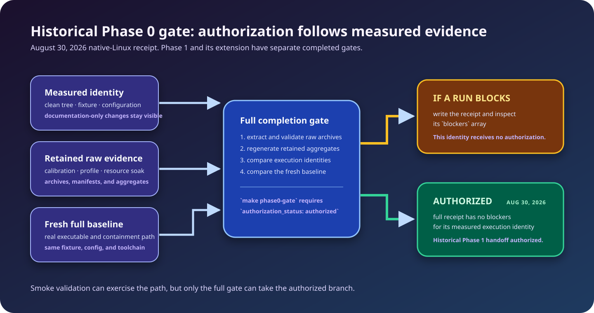

# Phase 0 completion gate

**Gate status: AUTHORIZED — Phase 1 is authorized for this branch's canonical execution identity.**

The retained August 30 [gate summary](../benchmarks/phase0/receipts/native-linux-2026-08-30-b932a935/gate-summary.json)
was emitted by a separate clean native-Linux checkout at commit
`b932a935e0a9438a4d47383f77367146fcefaee6` (tree
`5c2b93d5bc94187ae4471f5006e43c17ad218526`). The full gate exited 0 and
records `status: "pass"`, `authorization_status: "authorized"`,
`phase1_authorized: true`, and an empty `blockers` array. It also records
`production_ready: false` and `phase1_api_compatible: false`; authorization is
a Phase 1 engineering handoff, not a product-readiness claim.

The calibration, profiling, and soak inputs were measured from the clean,
pushed commit `52ac47542a05c0a1263f78a14c04a5c2e6b761f3` (tree
`cac3ececdbd0b5734691c30c0283fccff169a5f5`) and retained with the gate
defaults at `7acf0736…`. The gate independently reassembled and regenerated
those packages, then proved that their canonical execution-relevant identity
exactly matched the clean gate checkout:

```text
sha256:84d0f64d5661e74ed1dd74e0f4421be8a3ee35740f85aa110775305fcd6e929b
```

Documentation-only commits may retain this authorization only while that
canonical identity remains unchanged; their distinct Git commit and tree stay
auditable. GitHub issue state is not evidence. The August 29 receipt and its
`a724a5e3…` evidence remain immutable historical records, but they are not the
source of the current authorization.

The gate remains fail-closed for every future full run: it validates retained
archives, raw measurements, source identity, and a fresh baseline before it can
write an authorized receipt.

## Status at a glance

| Scope | Current status | What it means |
|---|---|---|
| Retained #39 calibration and resource soak | pass | The recorded native-Linux configuration has complete, verified plateau evidence. |
| Full Phase 0 completion gate | authorized | The retained August 30 clean native-Linux receipt is `pass` / `authorized` with no blockers for this canonical execution identity. |
| CI smoke sequence | validation only | A smoke pass exercises deterministic coverage; it never authorizes Phase 1. |
| Production readiness and public API compatibility | not claimed | Neither is a Phase 0 outcome. |



Some reports inside the retained evidence archives use the historical tense
appropriate to their measurement runs. They are immutable evidence, not the
current status source; this document and the machine receipt are authoritative
for authorization.

## Run the full gate

Run the full gate from a clean Linux or WSL checkout. WSL is sufficient to
verify retained evidence and produce a receipt. It is **not** sufficient to
collect replacement calibration, profiling, or soak evidence: those wrappers
require a clean native-Linux host or VM and reject WSL and containers.

Before running the gate, confirm that Git sees no tracked or untracked user
changes:

```bash
git status --porcelain --untracked-files=all
```

The gate creates its own ignored output under `target/phase0-gate/`. Other
untracked output can block authorization, so use an isolated clean clone or
worktree when in doubt.

After installing the pinned prerequisites in
[`development/toolchain.md`](development/toolchain.md), run:

```bash
python3.13 -m venv .venv
. .venv/bin/activate
python -m pip install --requirement tools/requirements.lock
make phase0-gate
```

The command creates a new directory beneath `target/phase0-gate/`, then:

1. runs repository formatting, builds, Clippy, Rust tests, contract/component
   validation, SDK checks, and repository-tool tests;
2. runs the real `latentd phase0-spike` executable E2E and containment suite;
3. runs a fresh full executable baseline, including the real Wasmtime path,
   capacity/queue saturation, recovery, cleanup, and topology probes; and
4. writes `gate-summary.json`, which rebuilds the calibration, profile, and
   soak aggregates from their retained raw inputs; verifies archive manifests,
   hashes, paths, and file sets; then compares the regenerated results with
   the checked-in aggregates before evaluating the fresh baseline.

`make phase0-gate` returns non-zero whenever a final receipt is not
`authorized`; it still writes the receipt so the specific blocker is
reviewable. The retained August 30 full run satisfied those fail-closed checks
with applicable evidence and a fresh baseline.

## Interpret the result

| Command | Baseline | Exit zero means | Phase 1 authorization |
|---|---|---|---|
| `make phase0-gate` | full | The full receipt is `authorized`. | Required and granted only by this result. |
| `make phase0-gate-smoke` | deterministic smoke | The smoke validation completed. | Never granted; its receipt may remain `blocked`. |

The smoke output explicitly distinguishes `Phase 0 smoke validation: PASS`
from `Phase 1 authorization: BLOCKED`, so deterministic correctness coverage
cannot be mistaken for a completed full gate. When a full run blocks, inspect
the retained `gate-summary.json` and address its `blockers`; GitHub issue state
does not override them.

## Current authorization evidence ledger

| Input | Machine-readable evidence | Gate result |
|---|---|---|
| Fresh full baseline | [receipt baseline](../benchmarks/phase0/receipts/native-linux-2026-08-30-b932a935/baseline/BASELINE.md), compressed raw result, and checksums | pass: 20 required hard checks and all required terminal outcomes |
| Native-Linux calibration | [`aggregate.json`](../benchmarks/phase0/calibration/native-linux-2026-08-30-52ac4754/aggregate.json) and checksummed 39-part raw archive | pass: seven full-profile runs with fixed hard invariants and advisory comparison bands |
| CPU/allocation profiling | [`aggregate.json`](../benchmarks/phase0/profiling/native-linux-2026-08-30-52ac4754/aggregate.json) and checksummed 51-part raw archive | pass: eight workloads, eight candidates, full 20-check invariant proof, guardrails, and seven explicit decisions |
| Resource soak | [`aggregate.json`](../benchmarks/phase0/soak/native-linux-2026-08-30-52ac4754/aggregate.json), [`SOAK.md`](../benchmarks/phase0/soak/native-linux-2026-08-30-52ac4754/SOAK.md), and checksummed 38-part raw archive | pass: three matched 100,000-activation processes, complete lifecycle evidence, and no calibrated material growth |
| Completion receipt | [`gate-summary.json`](../benchmarks/phase0/receipts/native-linux-2026-08-30-b932a935/gate-summary.json) and [receipt manifest](../benchmarks/phase0/receipts/native-linux-2026-08-30-b932a935/receipt.manifest.sha256) | pass / authorized; zero blockers |

### Historical August 29 ledger

The earlier baseline, calibration, profiling, soak, and
[`54d02679…` receipt](../benchmarks/phase0/receipts/native-linux-2026-08-29-54d02679/gate-summary.json)
remain unchanged for audit and archive-regression coverage. They describe the
older `a724a5e3…` execution identity and are not substituted for any August 30
authorization input.

| Historical input | Immutable record | Classification |
|---|---|---|
| Full baseline and receipt | [`native-linux-2026-08-29-54d02679`](../benchmarks/phase0/receipts/native-linux-2026-08-29-54d02679/) | historical pass; not a current input |
| Native-Linux calibration | [`native-linux-2026-08-29-a724a5e3`](../benchmarks/phase0/calibration/native-linux-2026-08-29-a724a5e3/) | historical seven-run reference |
| CPU/allocation profiling | [`native-linux-2026-08-29-a724a5e3`](../benchmarks/phase0/profiling/native-linux-2026-08-29-a724a5e3/) | historical v3 profile |
| Resource soak | [`native-linux-2026-08-29-a724a5e3`](../benchmarks/phase0/soak/native-linux-2026-08-29-a724a5e3/) | historical three-process soak |

## Recorded environment, configuration, and observations

The JSON aggregates above are cached conclusions, not trust roots. The gate
validates the underlying raw runs, host observations, execution-status records,
fixture/configuration/toolchain identities, profile artifacts, manifests, and
hashes; it then regenerates each aggregate with the repository aggregation
logic. The receipt also retains the current commit/tree and a canonical hash of
the execution-relevant Git entries. Every evidence set must have that same
canonical identity; documentation-only differences remain visible through the
recorded commit/tree but cannot hide an execution-affecting change.

- The authorizing calibration, `perf`/Heaptrack archive, and soak were measured
  on one native-Linux host from the same execution-relevant tree at
  `52ac4754…` / `cac3ecec…`. The retained commit/tree changes are auditable,
  while the canonical identity is the strict applicability comparison.
- The calibration retains seven full-profile runs. The profile covers cold
  preparation, prepared-cache reuse, first/warm execution, failure
  containment, cleanup, and both contention modes. Its decision ledger has
  seven retained/deferred/rejected decisions over eight candidates.
- The soak retains three independent native-Linux processes, each with 1,000
  excluded warm-ups, 100,000 measured fresh-store activations, real capacity
  and queue saturation batches, sampled post-warm-up resource series, and
  release/shutdown observations. Its strict aggregate reports matched
  calibration applicability, complete evidence, and passed descriptor
  lifecycle checks.
- The authorizing full baseline ran at `b932a935…` / `5c2b93d5…` against those
  retained inputs and passed all 20 required checks. Its freshly built
  collector matched the retained executable digest and size exactly. The raw
  result is compressed losslessly and checked alongside the complete receipt
  manifest.

## What the gate already proves

For the recorded local component and native-Linux environments, the evidence
proves that:

- generated WIT guest and host bindings build a real Rust echo Component Model
  guest and invoke it through Wasmtime;
- echo success and declared domain errors cross the real typed boundary;
- invalid component input is rejected by the executable/containment validation
  path before an activation can remain leased;
- trap, timeout, explicit cancellation, and memory-pressure failures remain
  activation-local and are followed by successful cause-specific recovery;
- every measured terminal path returns its cell or reports quarantine, with no
  active lease, waiter, store, cancellation registration, activation host
  state, temporary buffer, or unbounded history retained;
- configured runtime workers, process count, listeners/sockets, and cell
  capacity remain fixed throughout the measured spike lifecycle; and
- real at-capacity and bounded-queue workloads reach their configured bounds
  and return admitted work to a clean baseline.

The exact checks, scenarios, executable samples, and raw observations are
validated by [`tools/validate_phase0_gate.py`](../tools/validate_phase0_gate.py)
and [`tools/phase0_evidence.py`](../tools/phase0_evidence.py). The verifier
rejects malformed or synthetic archives, missing/additional/duplicate archive
paths, links, traversal attempts, changed raw artifacts, unverified profile
measurements, weakened guardrails, free-form optimization decisions, source
identity drift, and incomplete evidence presented as an authorization.

## Gate completion and audit handoff

The full receipt and raw evidence are retained in the repository as immutable
artifacts, including archive manifests, checksums, reports, aggregates, and the
losslessly compressed baseline result. Together they establish the current
authorization. Any future execution-relevant change invalidates applicability
and requires fresh evidence plus a new authorized receipt; documentation-only
changes must preserve the recorded canonical execution identity.

### If a future full run blocks

Preserve its `gate-summary.json` and resolve the recorded blockers rather than
editing an aggregate, archive, or receipt. A verifier failure before a receipt
exists is not evidence that it would pass. If the blocker is execution-identity
drift, regenerate the required native-Linux evidence chain for the changed
execution path, then rerun the full gate from a clean checkout.

## Audit and Phase 1 handoff

| Classification | Phase 0 asset | Phase 1 action |
|---|---|---|
| Retain | WIT authority, generated bindings, reproducible echo fixture | Keep as the maintained integration fixture and contract-generation foundation. |
| Retain | `ExecutionBackend`, `CellPool`, affine `CellLease`, fixed-capacity accounting | Preserve the seams and invariants while adding production implementations. |
| Retain | Machine-readable baseline, calibration, profile, and soak schemas | Keep as regression evidence; do not replace like-for-like comparison rules with SLO claims. |
| Harden | Wasmtime limits, fresh-store cleanup, interruption, bounded logging | Turn spike constants into explicit policy/configuration and telemetry without weakening cleanup proof. |
| Harden | One-entry prepared-component cache | Generalize to a bounded cache keyed by artifact, trust, and engine compatibility. |
| Generalize | `Phase0ActivationRunner` and `phase0_composition` | Add routing, admission, release resolution, budgets, and generic invocation without retaining echo-specific dispatch. |
| Rewrite | `latentd phase0-spike` JSON/exit-code surface | Treat it as a harness, not a public compatibility promise; replace it with Phase 1 CLI/RPC surfaces. |
| Delete after replacement | Test-only trap/infinite-loop/memory-pressure controls and benchmark-only entry points | Remove them from product dispatch when equivalent Phase 1 containment tests exist. |

Phase 1 must retain fresh invocation-owned stores, host state, import tables,
instances, limiters, and activation contexts; fixed node topology; bounded
state; activation-local failure containment; and affirmative cleanup proof.
The profile decision record defers worker/cell policy and Wasmtime/cache/value
work to #8 and #9, lifecycle-envelope work to #11, and rejects store/instance
reuse plus untrusted AOT/cache/snapshot/native-execution shortcuts in Phase 0.

## Explicit limits

An authorized Phase 0 gate establishes only a local feasibility and
measurement boundary. It does not establish production security, stable public
APIs, generic multi-service dispatch, persistent deployment management,
production scheduling or telemetry, performance SLOs, dormant-service density,
multi-node operation, Kubernetes replacement, realistic workloads, or
arbitrary-duration leak freedom. Phase 1 issue #2's Phase 0 gate dependency is
satisfied for this canonical execution identity; it must consume this
evidence/handoff rather than duplicate the spike.
