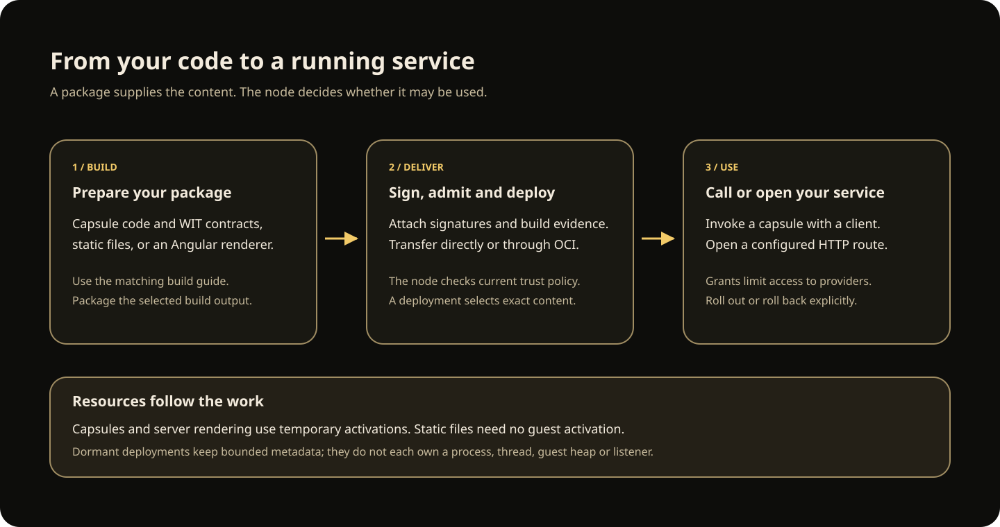

# Deliver packages and recover changes

Use LSF to deploy a capsule, publish a static website, or run a supported Angular
server renderer. The same delivery path keeps the package, its permissions and
its selected deployment together. You can move traffic to a new version and
recover a failed change without replacing the node.

If this is your first time using LSF, begin with [Run your first node](start/first-node.md).
That guide creates a node and calls a small echo service. Continue here when you
want to deliver your own application or manage a new version.

[Open the delivery diagram at full size](assets/package-delivery.svg).

## 1. Build the application you want to deliver

Choose a guide for your application. Each one identifies the required tools,
source files and commands for its supported build.

| Application | Follow this guide | Result |
| --- | --- | --- |
| A function called by another program | [Create a capsule](component-development/creating-a-capsule.md) | A Wasm component with typed inputs and outputs. |
| A static website or browser application | [Package a static site](component-development/static-sites.md) | Public files and a manifest describing their URLs. |
| An Angular application with server rendering | [Build an Angular application](component-development/angular-build.md) | Browser files and a renderer for the supported Angular profile. |

Package the selected output using [the packaging guide](component-development/packaging.md).
Package assembly does not compile your source: finish the application build first.
For a node that enforces publisher trust, also provide the required publisher
signature, build provenance and [SBOM](component-development/sbom.md).

## 2. Transfer and admit the package

Follow [Deliver, invoke and recover a capsule](learn/deliver-and-recover-a-capsule.md)
for the complete local delivery workflow. [Package and deployment operations](phase-2-operator-workflows.md)
cover inspection, verification and OCI push/pull commands when using a registry.
Registry credentials and node management credentials are separate.

A successful transfer means the selected bytes arrived. The node still checks
its own [publisher trust](reference/publisher-trust.md), tenant policy, package
requirements and current release eligibility before admission. A successful
local verification does not override those checks.

## 3. Deploy and try the application

Create a deployment that selects the admitted publication. Invoke a capsule
using the CLI or [a client SDK](learn/use-a-client.mdx). For browser delivery,
configure the [shared HTTP ingress](reference/http-ingress.md) and the route
specified by the static-site or Angular guide, then open that route in a browser.

Capsules and server rendering use temporary activations. Static files are served
without creating a guest activation. A dormant deployment has retained metadata;
it does not keep its own process, thread, guest heap or listener running.

If a capsule needs HTTP, storage or another capability, install its provider and
grant the required authority. The [standalone provider reference](reference/standalone-providers.md)
lists the providers accepted by the node configuration. Other provider
integrations have their own trusted Rust embedding instructions; adding an
unsupported field to the node JSON does not enable them.

## 4. Change a version deliberately

Use [a staged rollout](phase-2-rollouts.md) to move traffic to a candidate.
[Canary observation](phase-2-canary-observation.md) and
[explicit promotion](phase-2-canary-promotion.md) let you inspect a window before
advancing. [Rollback](phase-2-rollback.md) restores an eligible retained version
through a new route generation. Running activations keep their selected revision.

Keep the operation ID and original preconditions for every management change.
After a timeout or lost response, inspect that operation before submitting
another mutation. An unknown result can mean an absent or expired receipt; it
does not prove that the change never ran.

## Restart and recovery

Use the current [persistence and fresh-state instructions](reference/publication-catalog.md#supported-storage-and-fresh-state)
when preparing storage. Obsolete catalog formats are rejected; old binaries and
old catalogs are not an application rollback mechanism.

A protected node can refuse an immediate restart until its persisted clock floor
is reached. Follow [clock lease recovery](reference/package-admission.md#clock-leases-retries-and-fresh-admission).
Do not delete policy state or an audit journal to bypass that check.

A registry outage blocks transfers. Already retained packages can still run
when their current policy and release eligibility permit use. Cached bytes do
not extend an expired signature or undo revocation.

The current deployment is a standalone Linux node. Shared state transactions,
cluster placement and durable workflows are not supported. For resource and
security details, continue with [the architecture overview](architecture/overview.md).
