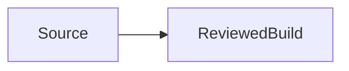

# Compiler fixture — Über 東京

Literal {notJavaScript} and `Map<string, number>` remain prose/code.

| Name | Outcome |
| --- | --- |
| Unicode | preserved |

## Details and HTML

<details>
<summary>Read the bounded outcome</summary>

This is ordinary Markdown inside details.

</details>

```typescript
const fixture = {value: '<not-an-element>'};
```


