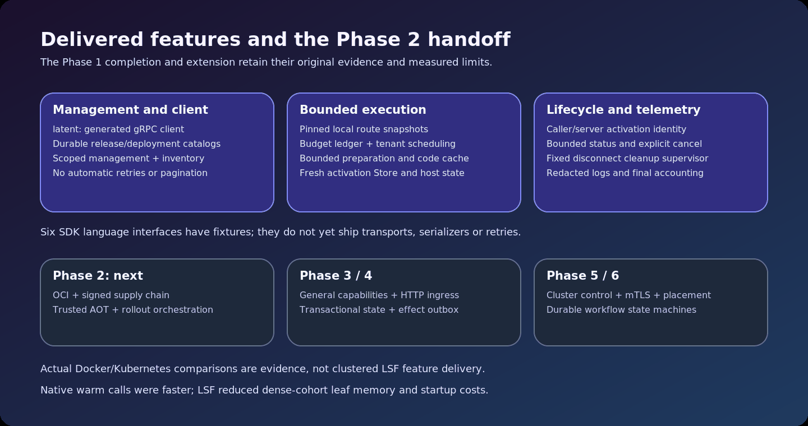

<!-- LSF-WIKI-MANAGED -->
# Current architecture

The supported deployment is one Linux `latentd` process with embedded local catalogs, configured in-process cell pools and loopback gRPC services. The `latent` CLI is a separate generated RPC client. A separate control plane, PostgreSQL deployment, node federation and general ingress adapters remain later work.

[Accessible SVG source](assets/system-decomposition.svg).

Management validates and durably publishes release/deployment metadata and immutable route snapshots. An invocation pins a local snapshot, reserves capacity, prepares immutable component readiness, schedules tenant work and executes in a fresh Store. Final accounting and cleanup belong to its activation owner. Bounded node caches and pools are not allocated once per dormant service.

One fixed async cleanup supervisor continues the same activation owner after a transport disconnect, under its original deadline and admitted capacity. It creates no per-disconnect task. Uncertain cleanup quarantines a cell instead of asserting reuse is safe.

Phase 2 adds OCI distribution, signatures, provenance, SBOM and trusted AOT supply-chain workflows. General capabilities, transactional state/effects, cluster control and durable workflows follow their roadmap phases.

Authorities: [overview](https://github.com/KirilsTurkins/latent-service-fabric/blob/release/docs/architecture/overview.md), [standalone node](https://github.com/KirilsTurkins/latent-service-fabric/blob/release/docs/reference/standalone-node.md), [data plane](https://github.com/KirilsTurkins/latent-service-fabric/blob/release/docs/architecture/data-plane.md).
