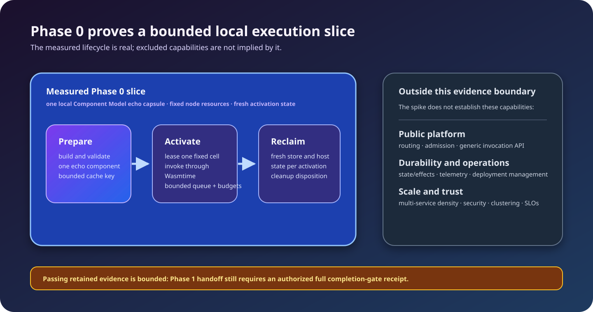

<!-- LSF-WIKI-MANAGED -->
# Architecture

LSF’s target architecture is a component-native execution fabric. Its present
implementation is intentionally much smaller: one local Phase 0 composition
that proves a specific Wasmtime/cell-pool/cleanup path.

## Implemented Phase 0 composition

```text
local capsule manifest + Component Model binary
  → bounded Wasmtime preparation/cache
  → fixed generic cell pool
  → fresh store + host state + budgets
  → invocation outcome
  → cleanup proof → release or quarantine
```

`latentd phase0-spike` is finite and local. It has no daemon listener, public
RPC surface, release catalog, route snapshot, or persistent state path.



## Target planes

The following are architectural direction, not Phase 0 runtime features:

| Plane | Intended responsibility |
|---|---|
| Developer plane | Build contracts/components, create capsules, generate provenance, and publish artifacts. |
| Control plane | Store desired state, validate releases, compile routes/bindings, evaluate policy, and distribute snapshots. |
| Data plane | Receive work, resolve routes, admit/schedule activations, materialize artifacts, execute guests, and account for results. |

The control plane is deliberately outside the ordinary invocation hot path
after a valid local route snapshot is available. Shared ingress should own
listeners and trigger loops; individual services should not.

## Fixed physical topology

The long-term model permits a configured number of execution hosts partitioned
by trust or workload class. That number is node policy, not service count.
Phase 0 uses one process and an in-process fixed pool; it does not prove the
future multi-process or clustered topology.

## Technology boundary

- WIT is the component-facing contract authority.
- Wasmtime is the first `ExecutionBackend` implementation.
- Protobuf describes control-plane and generic invocation APIs.
- JSON Schemas describe declarative resources.
- Rust traits preserve replaceable internal seams.

Read [Execution cells](Execution-Cells), [Contracts and APIs](Contracts-and-APIs),
and the [architecture overview](https://github.com/KirilsTurkins/latent-service-fabric/blob/development/docs/architecture/overview.md)
for the authoritative details.
