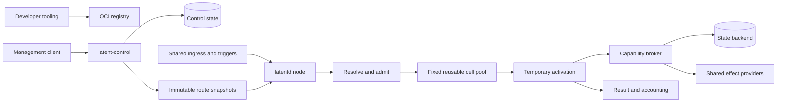

<!-- LSF-WIKI-MANAGED -->
# Latent Service Fabric

Latent Service Fabric (LSF) is an interface-first systems project for executing independently deployable service capsules without assigning persistent processes, sockets, threads, heaps, or connection pools to idle services.

> **Document role:** This Wiki is explanatory and non-normative. Canonical contracts, architecture decisions, policies, and implementation requirements live in the [main repository](https://github.com/KirilsTurkins/latent-service-fabric). When the Wiki and repository disagree, the repository is authoritative.

## Project status

LSF is currently an architecture, contract, API, validation, test, and benchmark scaffold. The repository intentionally does **not** yet provide a production runtime, scheduler, storage implementation, network transport, compiler service, or provider implementation.

The first vertical slice is intended to load one trusted capsule, resolve one route, admit one invocation, lease one generic execution cell, call one WIT export, return one result, reclaim activation-owned state, and prove that registering dormant services does not increase process, thread, socket, or cell counts.

## Core invariant

```text
resident resources = fixed node runtime + active activations + bounded shared caches
```

Artifact storage, route indexes, policy metadata, and bounded caches may grow with the number of registered services. Execution allocation must not.

## Start here

| Reader | Recommended path |
|---|---|
| New to LSF | [[Core-Concepts|Core concepts]] → [[Architecture]] → [[FAQ]] |
| Evaluating the design | [[Architecture]] → [[Execution-Cells|Execution cells]] → [[Security-and-Isolation|Security and isolation]] → [[Testing-and-Benchmarks|Testing and benchmarks]] |
| Building a capsule | [[Capsule-Development|Capsule development]] → [[Contracts-and-APIs|Contracts and APIs]] → [[State-and-Effects|State and effects]] |
| Contributing to LSF | [[Getting-Started|Getting started]] → [[Development-Workflow|Development workflow]] → [[Design-Governance|Design governance]] |
| Tracking implementation | [[Roadmap]] → [repository issues](https://github.com/KirilsTurkins/latent-service-fabric/issues) |

## Architecture at a glance



A service is not a process. A release is an immutable capsule artifact. A deployment combines a release with mutable grants and limits. A route selects a revision. A request becomes a temporary activation in a generic cell.

## Where authoritative information lives

| Subject | Canonical source |
|---|---|
| Project definition and repository layout | [README](https://github.com/KirilsTurkins/latent-service-fabric/blob/release/README.md) |
| Architecture index | [ARCHITECTURE.md](https://github.com/KirilsTurkins/latent-service-fabric/blob/release/ARCHITECTURE.md) |
| Detailed architecture | [`docs/architecture/`](https://github.com/KirilsTurkins/latent-service-fabric/tree/release/docs/architecture) |
| Activation and commit semantics | [`docs/protocol/`](https://github.com/KirilsTurkins/latent-service-fabric/tree/release/docs/protocol) |
| Guest contracts | [`wit/`](https://github.com/KirilsTurkins/latent-service-fabric/tree/release/wit) |
| Management and invocation APIs | [`api/proto/`](https://github.com/KirilsTurkins/latent-service-fabric/tree/release/api/proto) |
| Declarative resources | [`schemas/`](https://github.com/KirilsTurkins/latent-service-fabric/tree/release/schemas) |
| Internal subsystem seams | [`crates/`](https://github.com/KirilsTurkins/latent-service-fabric/tree/release/crates) |
| Accepted decisions | [`adr/`](https://github.com/KirilsTurkins/latent-service-fabric/tree/release/adr) |
| Future proposals | [`rfcs/`](https://github.com/KirilsTurkins/latent-service-fabric/tree/release/rfcs) |
| Contribution requirements | [CONTRIBUTING.md](https://github.com/KirilsTurkins/latent-service-fabric/blob/release/CONTRIBUTING.md) |
| Validation baseline | [VALIDATION.md](https://github.com/KirilsTurkins/latent-service-fabric/blob/release/VALIDATION.md) |
| Engineering phases | [Roadmap](https://github.com/KirilsTurkins/latent-service-fabric/blob/release/docs/roadmap.md) |

## Guiding distinction

```text
The repository defines LSF.
The Wiki explains LSF.
Issues and projects track the work.
```

Last reviewed against the `release` branch on **2026-08-22**.
