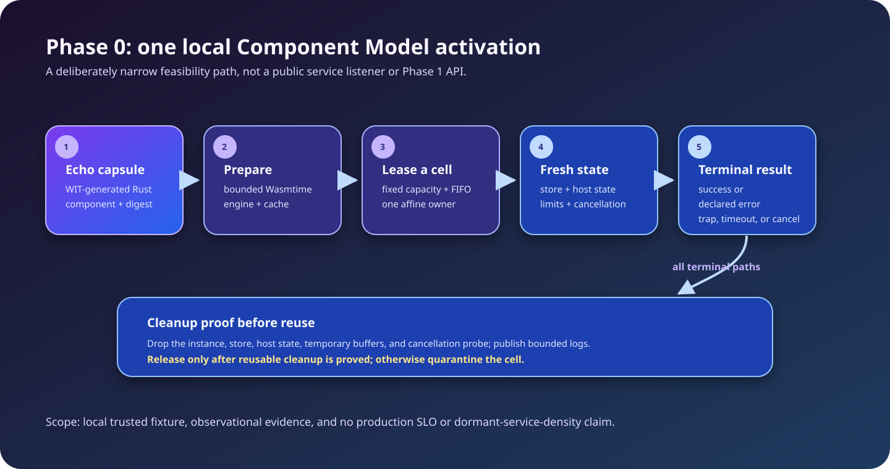

<!-- LSF-WIKI-MANAGED -->
<!-- LSF-PHASE0-GATE: authorized -->
# Latent Service Fabric

Latent Service Fabric (LSF) is an interface-first systems project for running
independently deployable service capsules without reserving a process, thread,
socket, heap, or connection pool for every idle service.

> **Current status:** the August 30 native-Linux full-gate receipt authorizes
> Phase 1 for its recorded canonical execution identity. That handoff is not a
> production-readiness or Phase 1 API-compatibility claim, and any later
> execution-affecting change must be revalidated.

The Wiki explains the project. The [`development` branch](https://github.com/KirilsTurkins/latent-service-fabric/tree/development)
is authoritative for code, contracts, evidence, and delivery status.

## How to read this Wiki

| Label | Meaning |
|---|---|
| **Implemented Phase 0** | A narrow local capability exercised by the checked-in executable spike. |
| **Recorded evidence** | A bounded observation for a specific fixture, configuration, environment, and source identity. |
| **Planned architecture** | A design direction or checked contract surface that still needs phase-specific runtime work and proof. |
| **Authorized handoff** | A claim made only by the full completion receipt when it explicitly authorizes the next phase. |

## The core resource rule

```text
resident resources = fixed node runtime + active activations + bounded shared caches
```

A deployment can have immutable code, metadata, policy, and routing identity
while dormant. Execution resources are allocated only when an invocation
becomes an activation.

## What Phase 0 actually implements

- A Rust echo guest built as a real WebAssembly Component through generated WIT bindings.
- A local `latentd phase0-spike` composition using real Wasmtime Component Model host bindings.
- A fixed-capacity generic cell pool with affine leases and a bounded FIFO queue.
- Fresh invocation-owned Wasmtime stores, host state, limits, cancellation, and bounded logs.
- Containment and recovery exercises for success, declared domain error, trap,
  deadline, cancellation, and memory pressure.
- Machine-readable baseline, calibration, profiling, and resource-soak evidence
  that the completion gate independently validates from raw artifacts.

## What it does not implement or prove

Phase 0 is not a production node or public API. It has no management listener,
route table, deployment catalog, persistent state/effect implementation,
generic multi-service dispatch, network transport, cluster operation,
production security posture, production SLO, or dormant-service-density proof.



## Start here

- [Phase 0 status](Phase-0-Status) — current authorization record, evidence
  boundary, and future revalidation path.
- [Phase 0 runbook](Phase-0-Runbook) — choose the correct validation and
  evidence path without confusing a local check with a handoff.
- [Getting started](Getting-Started) — validate the repository and run the
  local spike.
- [Architecture](Architecture) — distinguish the implemented spike from the
  target fabric.
- [Activation lifecycle](Activation-Lifecycle) and [Execution cells](Execution-Cells)
  — ownership, containment, and reclamation rules.
- [Contracts and APIs](Contracts-and-APIs) — WIT, Protobuf, schemas, Rust
  seams, and SDK roles.
- [Testing and benchmarks](Testing-and-Benchmarks) — verification commands and
  the native-Linux evidence boundary.
- [Roadmap](Roadmap) — Phase 0 through research promotion candidates.

## Choose a reading route

| If you want to… | Start here | Then continue with |
|---|---|---|
| Run and validate the local spike | [Getting started](Getting-Started) | [Phase 0 runbook](Phase-0-Runbook) and [Testing and benchmarks](Testing-and-Benchmarks) |
| Understand the execution model | [Core concepts](Core-Concepts) | [Architecture](Architecture), [Activation lifecycle](Activation-Lifecycle), and [Execution cells](Execution-Cells) |
| Evaluate Phase 0 handoff readiness | [Phase 0 status](Phase-0-Status) | [Phase 0 runbook](Phase-0-Runbook), then the authoritative receipt and evidence ledger |
| Plan a later capability | [Roadmap](Roadmap) | The relevant target-architecture page and linked repository authority |

## Canonical sources

| Topic | Repository authority |
|---|---|
| Project definition and current boundary | [README](https://github.com/KirilsTurkins/latent-service-fabric/blob/development/README.md) |
| Phase 0 receipt and evidence ledger | [docs/phase-0-completion.md](https://github.com/KirilsTurkins/latent-service-fabric/blob/development/docs/phase-0-completion.md) |
| Architecture | [ARCHITECTURE.md](https://github.com/KirilsTurkins/latent-service-fabric/blob/development/ARCHITECTURE.md) and [docs/architecture](https://github.com/KirilsTurkins/latent-service-fabric/tree/development/docs/architecture) |
| Validation | [VALIDATION.md](https://github.com/KirilsTurkins/latent-service-fabric/blob/development/VALIDATION.md) |
| Engineering phases | [docs/roadmap.md](https://github.com/KirilsTurkins/latent-service-fabric/blob/development/docs/roadmap.md) |
| Open work | [GitHub issues](https://github.com/KirilsTurkins/latent-service-fabric/issues) |

The key distinction is simple: repository source defines LSF, this Wiki makes
it easier to navigate, and an authorized receipt—not narrative—establishes the
Phase 0 handoff.
