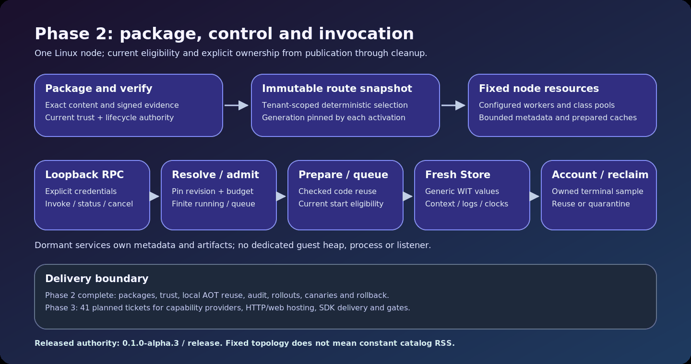

<!-- LSF-WIKI-MANAGED -->
# Latent Service Fabric

**Phase 1 and its performance extension are complete.** LSF provides a configured single-node stateless fabric: durable release/deployment catalogs, immutable routing, bounded admission and tenant-fair scheduling, generic Wasmtime execution, invocation/status/cancellation RPCs, telemetry and a working operator CLI. The delivery line is **0.1.0-alpha.2**, a prerelease with explicitly bounded support.

A dormant service owns metadata and artifacts, but no dedicated process, thread, listener, guest heap, cell or connection pool. Metadata memory grows with catalog size; fixed execution topology does not mean constant total RSS.

[Accessible SVG source](assets/architecture-at-a-glance.svg). Every fact is present in the static drawing and surrounding prose.

| Reader | Guide |
| --- | --- |
| Run the system | [Getting started](Getting-Started), [Operator CLI](Operator-CLI) |
| Check delivered features | [Phase 1 status](Phase-1-Status), [Architecture](Architecture) |
| Evaluate performance | [Performance and infrastructure](Performance-and-Infrastructure), [Testing](Testing-and-Benchmarks) |
| Integrate a capsule/client | [Capsule development](Capsule-Development), [Contracts](Contracts-and-APIs), [SDKs](SDKs) |
| Follow upcoming work | [Roadmap](Roadmap), [State and effects](State-and-Effects) |
| Read historical authorization | [Phase 0 status](Phase-0-Status) |

The [September 8 functional completion](https://github.com/KirilsTurkins/latent-service-fabric/blob/release/docs/phase-1-completion.md) and [September 11 extension report](https://github.com/KirilsTurkins/latent-service-fabric/blob/release/docs/phase-1-extension-completion.md) preserve their own sources and measurements. The [extension milestone is closed](https://github.com/KirilsTurkins/latent-service-fabric/milestone/5). Phase 2 packaging and supply-chain work is next.

Completion does not establish production security, HA, cloud capacity, universal millisecond deadlines or stable SDK transports. Actual Docker/Kubernetes benchmarks do not implement clustered LSF control.

Reviewed September 11, 2026. This Wiki is explanatory; the [release repository](https://github.com/KirilsTurkins/latent-service-fabric/tree/release) is authoritative. The isolated Wiki source branch is not a runnable release reference.
