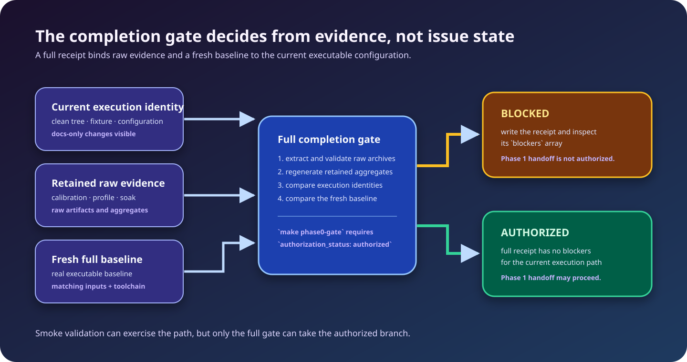

<!-- LSF-WIKI-MANAGED -->
<!-- LSF-PHASE0-GATE: authorized -->
# Phase 0 status and evidence

> **Status: Phase 1 authorized for the recorded canonical execution identity.**
> The [August 30 clean native-Linux full receipt](https://github.com/KirilsTurkins/latent-service-fabric/blob/development/benchmarks/phase0/receipts/native-linux-2026-08-30-b932a935/gate-summary.json)
> is `pass` / `authorized`, has no blockers, and explicitly records
> `phase1_authorized: true`. It grants an engineering handoff only; it does not
> claim production readiness or Phase 1 API compatibility.

The [completion-gate document](https://github.com/KirilsTurkins/latent-service-fabric/blob/development/docs/phase-0-completion.md)
is the authoritative status record. This page explains how to read it without
turning issue administration or a partial result into a product claim.

## Implemented feasibility slice

The spike exercises a generated Rust echo Component Model guest through real
Wasmtime bindings, a fixed cell pool, bounded caching, fresh invocation state,
and explicit cleanup. It tests success, declared domain error, trap, timeout,
cancellation, memory pressure, capacity/queue behavior, and cause-specific
recovery.

The result is local and observational. It is neither a Phase 1 API contract
nor a production readiness statement.

## Evidence ledger

| Evidence | What it records | How the gate treats it |
|---|---|---|
| Executable baseline | Real `latentd` composition, terminal scenarios, topology, cleanup, and resource probes | A fresh baseline is produced for each full gate run. |
| Native-Linux calibration | Repeated full-profile runs and advisory noise bands | Raw runs and host/execution records are verified and regenerated. |
| CPU/allocation profile | `perf`, Heaptrack, invariant proof, and explicit optimization decisions | Artifacts and aggregate conclusions are independently verified. |
| Resource soak | Independent long-running processes, lifecycle observations, and calibrated plateau analysis | Archive integrity and raw lifecycle evidence are verified and regenerated. |

The retained native-Linux soak is a passing result for its recorded
configuration. It participates in the authorizing receipt but does not make an
authorization decision alone; a later execution-affecting checkout must again
satisfy source identity, configuration, archive, profiling, and fresh-baseline
requirements.

## What `make phase0-gate` does

The full gate:

1. runs formatting, Rust build/lint/test, contracts/components, SDK checks, and
   repository-tool tests;
2. runs the real local executable spike and containment path;
3. produces a new full executable baseline; and
4. validates raw calibration, profile, and soak artifacts against their
   manifests and aggregates, then compares their execution identity and
   configuration with the current checkout.

It emits `target/phase0-gate/.../gate-summary.json` even when a future run is
blocked. That receipt contains the exact blockers. The command returns success
only when authorization is genuine.

For command selection and a safe response to a blocked result, use the
[Phase 0 runbook](Phase-0-Runbook).

## Read the receipt, not just the exit code

For a handoff decision, inspect all of the following together:

| Receipt field | Required interpretation |
|---|---|
| **authorization status** | Must be authorized; a passing sub-check is not enough. |
| **Phase 1 authorized** | Must be true; it is the unambiguous machine-facing handoff signal. |
| **blockers** | Must be empty; each entry explains why a result remains fail-closed. |
| **source and execution identity** | Must match the evidence path or be supported by an explicit compatibility rule. |

## Evidence rules

- New reference calibration, profiling, and soak evidence must be gathered on
  a clean native Linux host or VM, never WSL or a container.
- A source or configuration change needs compatible evidence; stale evidence
  cannot be relabeled to match a newer implementation.
- Archive hashes alone are insufficient: the gate validates paths, manifests,
  raw documents, identities, and regenerated aggregates.
- Noise bands inform comparison; they do not weaken hard containment or
  resource invariants and are not production SLOs.

## Explicit non-conclusions

The authorized Phase 0 receipt does not establish production security, stable
public APIs, generic dispatch, multi-service density, remote calls, cluster
operation, durable state/effects, realistic workload performance, or
arbitrary-duration leak freedom. Those require later phase evidence.
