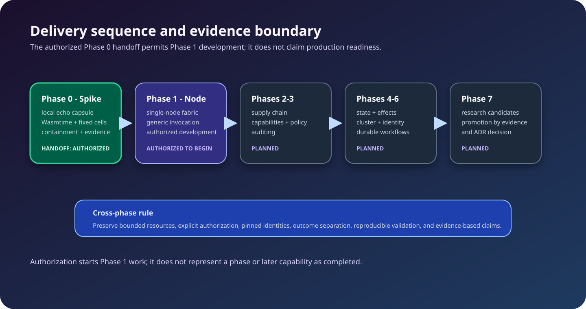

<!-- LSF-WIKI-MANAGED -->
<!-- LSF-PHASE0-GATE: authorized -->
# Roadmap

The roadmap communicates intended sequencing. It is not a claim that a phase
has shipped, nor does it replace the authoritative [engineering roadmap](https://github.com/KirilsTurkins/latent-service-fabric/blob/development/docs/roadmap.md)
or linked issues.

## Phase 0 — executable spike

Implemented: repository contracts, one Rust echo component, Wasmtime Component
Model loading, fixed generic cells, containment/recovery tests, baseline
measurements, calibration, profiling, and resource-soak evidence.

**Gate state:** authorized for the August 30 clean native-Linux receipt's
canonical execution identity. The authorizing full receipt validates matched
raw archives, execution identity, profiling, resource soak, and a fresh
baseline together. A closed issue, passing raw aggregate, or smoke result is
not an equivalent authorization.

Use the [Phase 0 runbook](Phase-0-Runbook) to distinguish ordinary validation,
smoke validation, the full gate, and native-Linux evidence collection.

## Authorization is not a completion claim

The receipt authorizes Phase 1 engineering work for its canonical execution
identity. It does not represent a later capability as merged, complete, or
production-ready, and it cannot substitute for issue-specific design, tests,
or acceptance evidence. The linked issue and repository authority determine
when each change is ready to merge or close.

## Phase 1 — single-node stateless fabric — authorized to begin

Authorized scope: standalone node, local release catalog and route table,
admission and scheduling, activation envelopes/budgets, baseline capabilities,
generic invocation, CLI flow, and telemetry. Individual features remain
subject to their own issue acceptance criteria.

## Phase 2 — packaging and supply chain

Planned: OCI push/pull, signatures, provenance, SBOM, trusted AOT cache,
atomic routes, canary, and rollback.

## Phase 3 — capabilities

Planned: capability broker, policy grants, HTTP, blobs, secrets, events,
bounded provider pooling, auditing, and descendant budgets.

## Phase 4 — state and effects

Planned: transactional keyed state, optimistic concurrency, durable outbox,
effect dispatch, idempotency, and entity-key routing.

## Phase 5 — cluster

Planned: separated control plane, route watches, direct node invocation, mTLS
identity, artifact prefetch, state affinity, and multi-zone placement.

## Phase 6 — durable workflows

Planned: explicit workflow state machines, timers, continuations, awaited
effects, replay, and compensation.

## Phase 7 — research promotion candidates

Candidate tracks include paging, continuation eviction, call-graph fusion,
immutable shared blobs, adaptive materialization, native software fault
isolation, and hardware capabilities. Promotion requires evidence and an
accepted decision; research is not a baseline dependency.

Every phase must preserve bounded resources, explicit authorization, pinned
identity, domain/platform error separation, reproducible validation, and
evidence-based claims.
